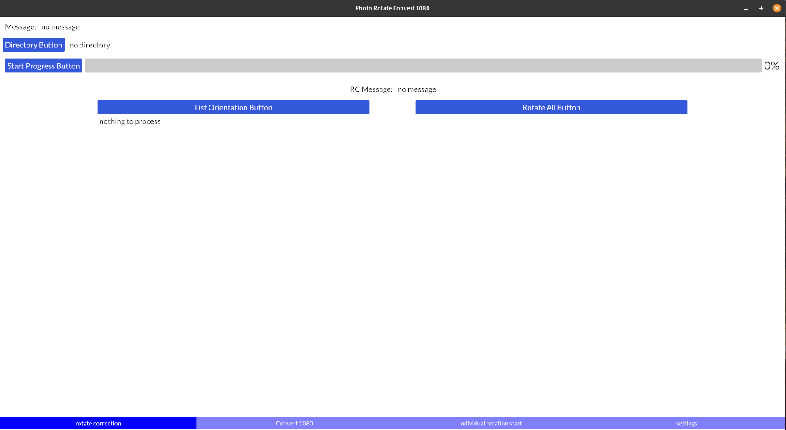
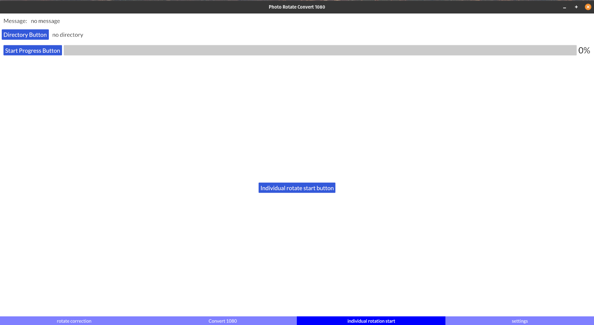
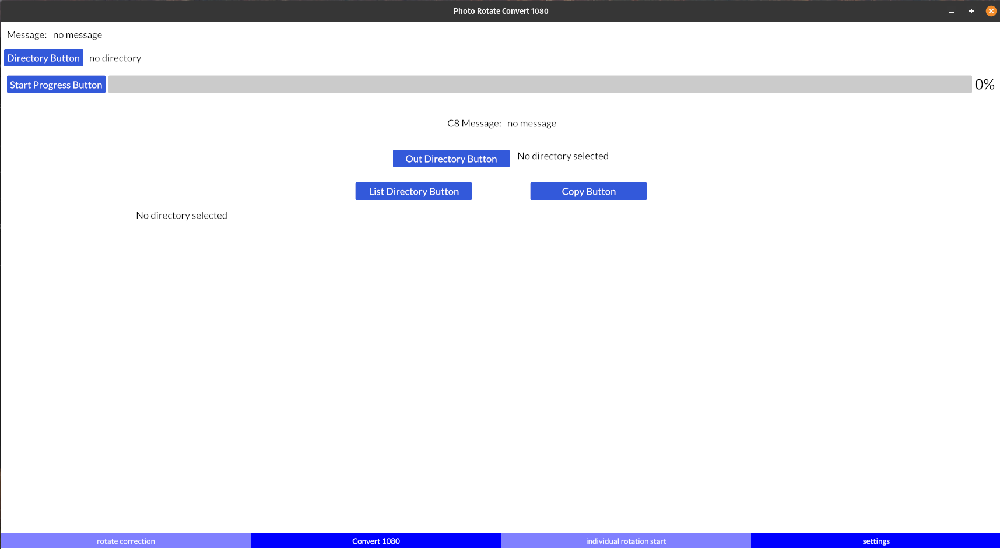

# photorot1080
Rust-Iced Image rotational correction and conversion to 1920x1080

This program has three major functions.
First is to set the exif orientation to 1 and rotate the image accordingly.
Second is to review the images and rotating them if necessary. 
        This is just a call to another program indivrotate01.
Third is to convert the images to landscape 1920x1080.
For rotation, the program calls gimp and requires stored gimp parameters to run.
For the conversion, the program calls imagemagick's convert with black background.

