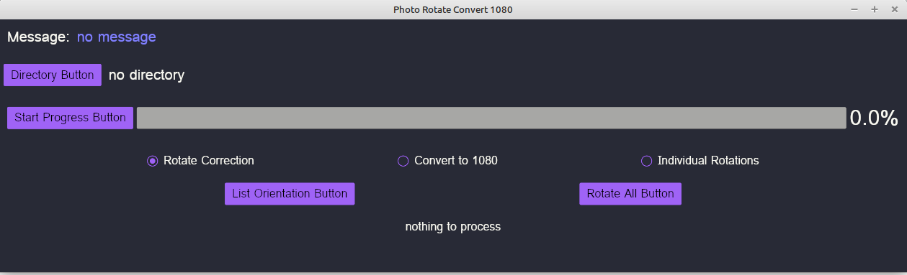
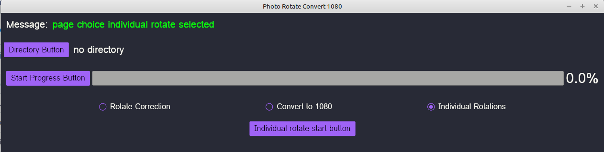
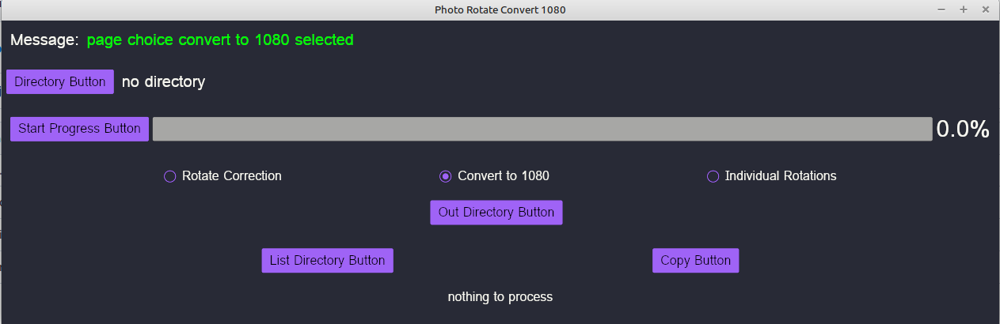

# photorot1080
Rust-Iced Image rotational correction and conversion to 1920x1080

This program calls winitsize01 to get the smallest monitor size.

This program has three major functions.

First is to set the exif orientation to 1 and rotate the image accordingly.

This calls gimp to change the orientation. require gimp scripts (see folder).

Second is to review the images and rotating them if necessary. 

This is just a call to another program indivrotate (see in another repository) 

Third is to convert the images to landscape 1920x1080.

This calls magick to do the conversion.

